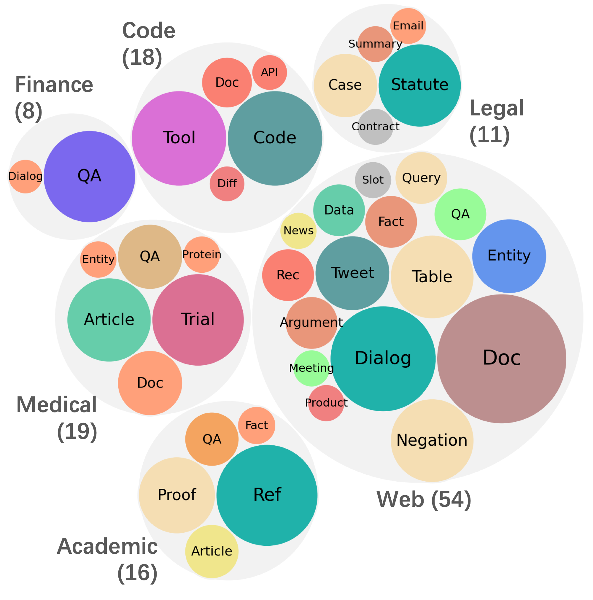
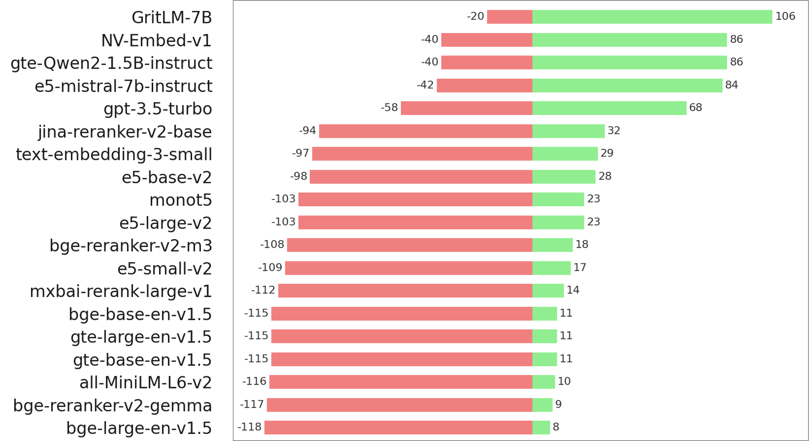
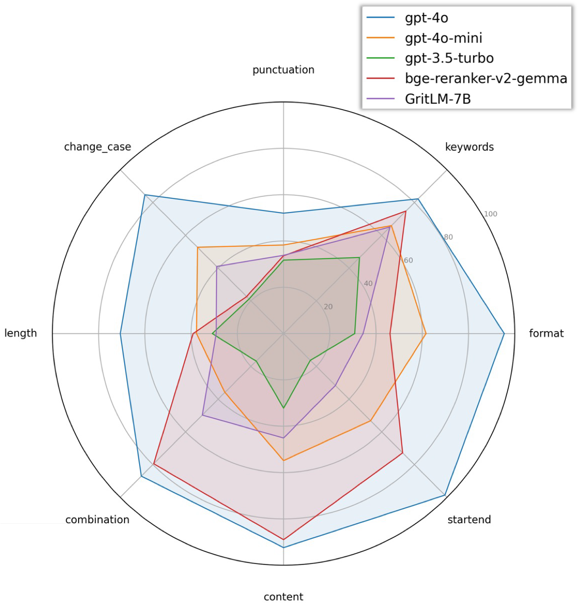

# MAIR: A Massive Benchmark for Evaluating Instructed Retrieval

[](https://arxiv.org/abs/2410.10127)
[](https://www.apache.org/licenses/LICENSE-2.0)

We introduce MAIR (Massive Instructed Retrieval Benchmark), a heterogeneous benchmark designed for evaluating instructed information retrieval (IR). MAIR includes 126 retrieval tasks across 6 domains, collected from existing datasets, with each query annotated with detailed retrieval instructions. Compared to other IR benchmarks, MAIR extends the evaluation scope to broader IR applications, including those in RAG, code retrieval, agent-based retrieval, biomedical, legal IR, and more. It also enhances evaluation efficiency through careful data sampling and diversification.

- Paper: [MAIR: A Massive Benchmark for Evaluating Instructed Retrieval](https://arxiv.org/abs/2410.10127)
- Data Examples: [MAIR-Example.pdf](https://github.com/sunnweiwei/MAIR/blob/main/assets/MAIR-Example.pdf)

## News
- **[2024.10.14]** Our paper is accepted by EMNLP 2024 Main conference.

## Data
| Data | Link |
| ---- | ---- |
| Queries   | https://huggingface.co/datasets/MAIR-Bench/MAIR-Queries |
| Docs | https://huggingface.co/datasets/MAIR-Bench/MAIR-Docs |

### Queries Data
```python
from datasets import load_dataset
data = load_dataset('MAIR-Bench/MAIR-Queries', 'TASK_NAME')
# e.g., load_dataset('MAIR-Bench/MAIR-Queries', 'CliniDS_2016') to load CliniDS_2016
```
Each row contains four fields:
- `qid`: The query ID.
- `instruction`: The task instruction associated with the query.
- `query`: The content of the query.
- `labels`: A list of relevant documents. Each contains:
- - `id`: The ID of a positive document.
- - `score`: The relevance score of the document (usually 1, but can be higher for multi-graded datasets).
 
### Docs Data
```python
docs = load_dataset('MAIR-Bench/MAIR-Docs', 'TASK_NAME')
# e.g., load_dataset('MAIR-Bench/MAIR-Docs', 'CliniDS_2016') to load docs for CliniDS_2016
```
Each row contains:
- `id`: The ID of the document.
- `doc`: The content of the document.

The following figure shows the tasks and domains in MAIR:
<p align="center">
  
</p>

<details>
<summary>List of 6 domains and 126 tasks.</summary>
  
### Web
- **Table:** WebTableSearch, SParC, SParC-SQL, Spider, Spider-SQL
- **Negation:** ExcluIR, Core17, News21, Robust04, NevIR
- **Entity:** AY2, WnCw, WnWi
- **Tweet:** Microblog_2011, Microblog_2012, Microblog_2013, Microblog_2014
- **Data:** ACORDAR, NTCIR
- **Dialog:** WoW, TopiOCQA, ProCIS-Dialog, ProCIS-Turn, CAsT_2019, CAsT_2020, CAsT_2021, CAsT_2022
- **Fact:** Fever, QuanTemp
- **Meeting:** MISeD
- **Argument:** ArguAna, Touche
- **Doc:** Core_2017, DD_2015, DD_2016, DD_2017, FairRanking_2021, FairRanking_2022, NeuCLIR-Tech_2023, NeuCLIR_2022, NeuCLIR_2023, ToT_2023, ToT_2024, InstructIR
- **Rec:** CPCD, PointRec
- **Query:** CQADupStack, Quora
- **News:** ChroniclingAmericaQA
- **Slot:** TREx, zsRE
- **QA:** ELI5, IFEval
- **Product:** ProductSearch_2023

### Medical
- **Article:** PrecisionMedicine-Article_2019, PrecisionMedicine-Article_2020, CliniDS_2014, CliniDS_2015, CliniDS_2016
- **Entity:** Genomics-AdHoc_2007
- **Trial:** PrecisionMedicine_2017, PrecisionMedicine_2018, PrecisionMedicine_2019, ClinicalTrials_2021, ClinicalTrials_2022, ClinicalTrials_2023
- **Protein:** CARE
- **Doc:** Genomics-AdHoc_2004, Genomics-AdHoc_2005, Genomics-AdHoc_2006
- **QA:** NFCorpus, Trec-Covid, Monant

### Code
- **Agent:** RepoBench, SWE-Bench-Lite
- **Tool:** FoodAPI, HuggingfaceAPI, PytorchAPI, SpotifyAPI, TMDB, TensorAPI, ToolBench, WeatherAPI
- **Code:** APPS, CodeSearchNet, HumanEval-X, LeetCode, MBPP
- **Doc:** Conala, TLDR
- **Diff:** CodeEditSearch

### Legal
- **Summary:** BillSum
- **Case:** AILA2019-Case, GerDaLIR, LeCaRDv2
- **Statute:** AILA2019-Statutes, BSARD, LegalQuAD, REGIR-EU2UK, REGIR-UK2EU
- **Email:** TREC-Legal_2011
- **Contract:** CUAD


### Finance
- **Dialog:** ConvFinQA
- **QA:** Apple, FinQA, FinanceBench, HC3Finance, TAT-DQA, Trade-the-event, FiQA


### Academic
- **Article:** LitSearch, FairRanking_2020
- **Ref:** ProofWiki_Reference, Stacks_Reference, Stein_Reference, Trench_Reference, TAD, TAS2, SciDocs
- **Proof:** ProofWiki_Proof, Stacks_Proof, Stein_Proof, Trench_Proof
- **Fact:** SciFact
- **QA:** Competition-Math, StackMathQA
  
</details>

## Evaluation Script
Evaluating text embedding models
```python
from mair import eval_embedding
from sentence_transformers import SentenceTransformer
model = SentenceTransformer('Alibaba-NLP/gte-base-en-v1.5', trust_remote_code=True)
outputs = eval_embedding(model, tasks=['CQADupStack'], instruct=True)  # tasks is a list of task names to be evaluated. outputs contain retrieval results, which can be used as input for reranker
```

Evaluating re-ranking models
```python
from mair import eval_rerank
from sentence_transformers import CrossEncoder
model = CrossEncoder("jinaai/jina-reranker-v2-base-multilingual", automodel_args={"torch_dtype": "auto"}, trust_remote_code=True)
outputs = eval_rerank(model, tasks=['MISeD'], instruct=True, first_stage=None)  # first_stage is the first-stage retrieval results. If None, then use OpenAI text-embedding-3-small results cached at MAIR-Bench/MAIR-Results-text-embedding-3-small
```

Evaluating RankGPT
```python
from mair import eval_rerank
from rankgpt import RankGPT
model = RankGPT(model='gpt-4o-mini')
outputs = eval_rerank(model, tasks=['Core17'], instruct=True, first_stage=None)
```

Evaluating BM25
```python
from mair import eval_bm25
outputs = eval_bm25(tasks=['SWE-Bench-Lite'], instruct=False)
```

Evaluating multiple tasks or domains
```python
from config import get_tasks_by_domain, get_all_tasks, TASK_CONFIG
get_tasks_by_domain('Code')  # returns a list of tasks for a domain
get_all_tasks()  # returns a list of all tasks
TASK_CONFIG  # task name -> domain mapping
```

<p align="center">
  
</p>

### Evaluation on IFEval
We designed the IFEval task (Zhou et al., 2023) within MAIR, which consists of 8 different instruction-following subtasks, such as `format` (selecting responses in a specific format), `keywords` (including specific words), and `length` (adhering to length restrictions). 
```python
from mair import eval_rerank
from rankgpt import RankGPT
model = RankGPT(model='gpt-4o')
results = eval_rerank(model=model, tasks=['IFEval'])
```

<p align="center">
  
</p>

## Cite
```
@inproceedings{Sun2024MAIR,
  title={MAIR: A Massive Benchmark for Evaluating Instructed Retrieval},
  author={Weiwei Sun and Zhengliang Shi and Jiulong Wu and Lingyong Yan and Xinyu Ma and Yiding Liu and Min Cao and Dawei Yin and Zhaochun Ren},
  booktitle={EMNLP},
  year={2024},
}
```


